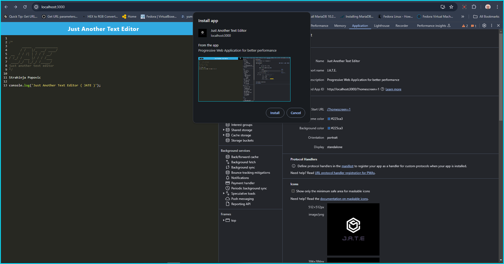
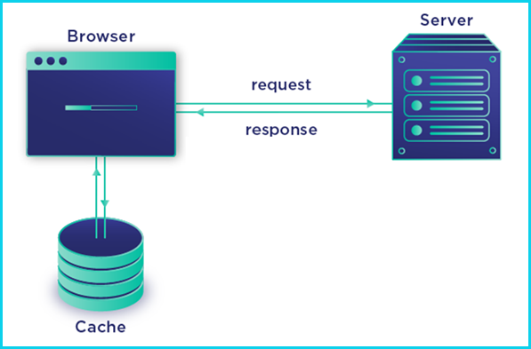
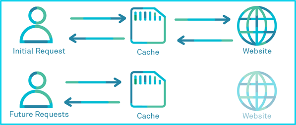
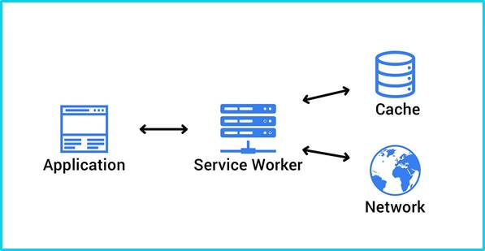
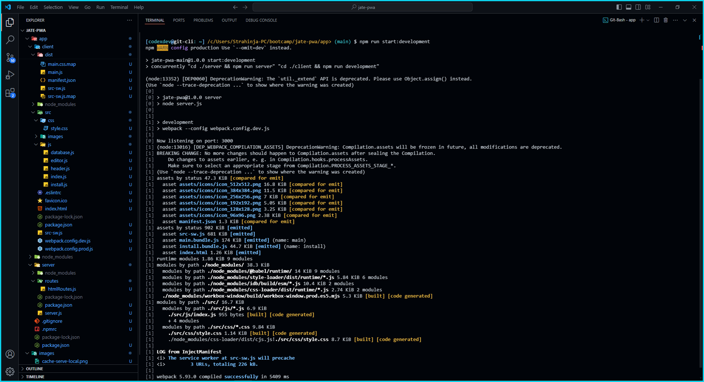
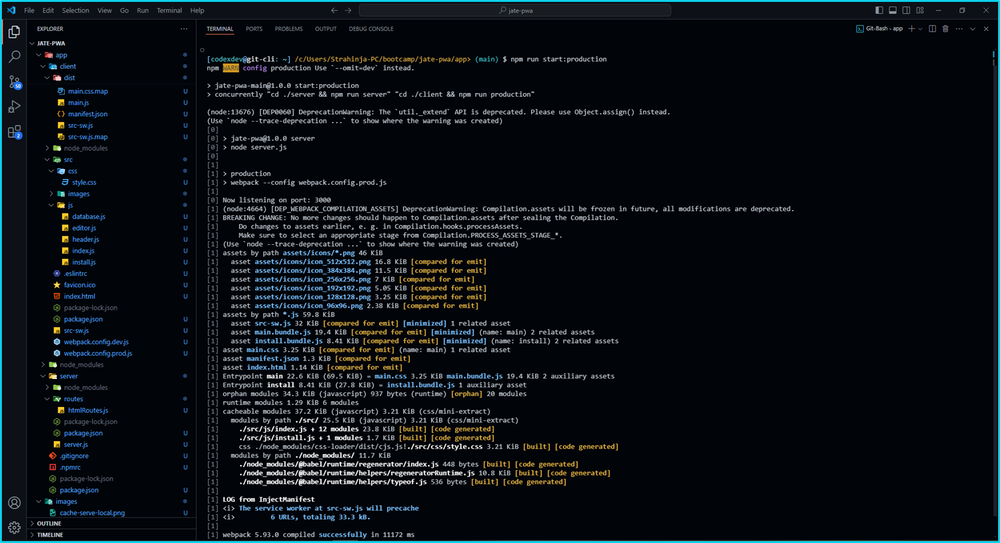

# jate-pwa

## Jast Another Text Editor ( JATE ) and Progressive Web Application ( PWA )

### JATE is text editor incorporating some of the PWA technologies like Workbox Service Proxy Worker helping with page-cache and static-resources management and Webpack configuration generator for Manifest.json and ./dist directory builder.

[](https://opensource.org/licenses/MIT) 

     



## Table of Content

- [Description Info](#description-info)
- [Working with cache](#working-with-cache)
- [Service Worker (Proxy Web Worker)](#service-worker-proxy-web-worker)
- [Installation Process](#installation-process)
- [License](#license)
- [Questions and Contacts](#questions-and-contacts)

## Description Info

### This is single-page application that runs in the client browser. Program `jate-pwa` when runned generates manifest file (`manifest.json`) and proxy web worker (`workbox service worker`) from configurations files (`webpac.config.js` and `src-sw.js`) and deployes it as PWA JATE text editor application with ability to uses the in-app installation UI. Image showed bellow.

## Working with cache

While using the browser on network and wisiting sites and online applications, browser stores temporary data and information as local storage data collection that are called cache. Cache or local stored data help current application to manage resources much faster by retriving data localy then to requesting data allways from remote server on the network. This is possible only for resources already been stored and maintained localy. Image showed bellow.

[](./images/request-cache.png) [](./images/cache-serve-local.png)

On the first image first request from the client goes to the remote server and requests resources and data, then grtting back to the client browser and application and do additional processing of the request, transform data for local storage, so same requests later serve from local cache.  

## Service Worker (Proxy Web Worker)

A Service Worker is a type of web worker that runs in the background of a web application, independent of the web page's main thread. They allow developers to build offline web applications, load faster, and provide a more reliable user experience.

[](./images/service-worker.jpg)

## Installation Process

To initialize package.json and to install dir node_packages over Git Bash terminal in the root dir (`~/jate-pwa/app>`) run

```bash
$ npm init # initialize formating file ./package.json OR if .json already exists just

$ npm install # installing formating dir ./node_packages
```
After installing packages within root directory (`~/jate-pwa/app>`) run the following command to start (triger) `build` process 

```bash
$ npm run start:development # development mode 
```
### Output at terminal console after running script for development

[](./images/run-dev-output-bord.png)

OR alternatively,

```bash
$ npm run start:production # production mode
```
### Output at terminal console after running script for production

[](./images/run-prod-output-bord.png)

Available scripts can be found at `package.json` file at client directory at `~/app/client/package.json>` file.

```json
"scripts": {
    "start:development": "concurrently \"cd ./server && npm run server\" \"cd ./client && npm run development\"",
    "start:production": "concurrently \"cd ./server && npm run server\" \"cd ./client && npm run production\""
  }
```
## License

Copyright © 2024, [codexdev](https://github.com/strahinjapopovic). Released under the [MIT License](./LICENSE).

<a id="questions-and-contacts"></a>
## Questions and Contacts

Questions about application can be reffered to the author's [GitHub account](https://github.com/strahinjapopovic) or you can [Contact Me](mailto:spope.mails@gmail.com) directly over an email.